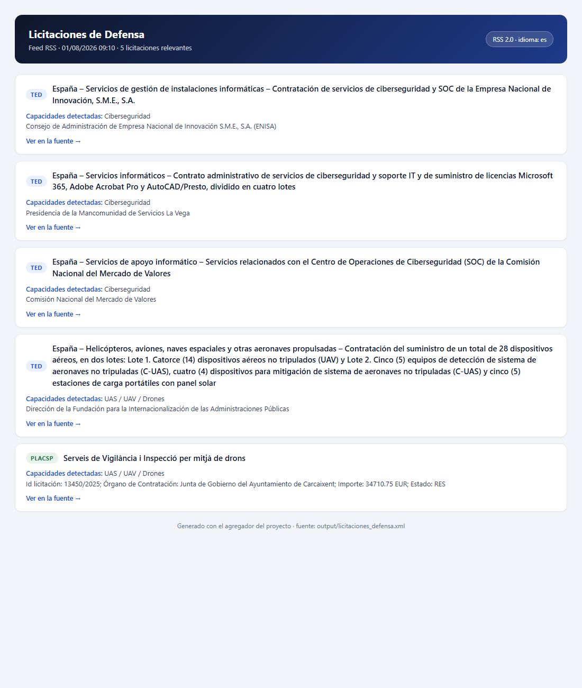

# Radar de licitaciones de defensa (PYME)

Agregador diario que consulta fuentes públicas de licitaciones, las filtra
según las **capacidades de tu empresa** (definidas en `config.yaml`) y
genera un feed RSS único que puedes leer en Feedly, Inoreader, etc.

## Instalación

```bash
python3 -m venv venv
source venv/bin/activate
pip install -r requirements.txt
```

## Uso

Genera el feed con la configuración por defecto (`config.yaml`):

```bash
python aggregator.py
# genera output/licitaciones_defensa.xml
```

Para usar otro fichero de configuración (p. ej. una versión de prueba):

```bash
python aggregator.py --config config_pruebas.yaml
```

### Ver el resultado

El feed es un RSS 2.0 estándar: puedes abrirlo en cualquier lector o inspeccionarlo
desde la terminal:

```bash
# cabecera del canal y primer item
head -30 output/licitaciones_defensa.xml

# cuántas licitaciones relevantes se han publicado
python -c "import feedparser; print(len(feedparser.parse('output/licitaciones_defensa.xml').entries))"

# listar títulos y enlaces desde Python (útil para integrarlo en tu propio script)
python - <<'EOF'
import feedparser

feed = feedparser.parse("output/licitaciones_defensa.xml")
for entrada in feed.entries:
    print(f"[{entrada.title.split(']')[0].lstrip('[')}] {entrada.title.split('] ', 1)[-1]}")
    print(f"  -> {entrada.link}")
EOF
```

### Leer el feed en un lector RSS

- **Local**: abre `output/licitaciones_defensa.xml` directamente en tu lector
  (Feedly, Inoreader, Thunderbird, Newsboat, ...).
- **En la nube**: publica el `.xml` como GitHub Pages o en cualquier hosting
  estático (ver [Automatización diaria](#automatización-diaria)) y añade esa URL
  a tu lector: el feed se actualiza cada vez que se re-ejecuta el agregador.

## Captura del feed

Vista previa de `output/licitaciones_defensa.xml` renderizada como la verías en
un lector de feeds (cada item con su fuente y las capacidades detectadas):



La captura se regenera en dos pasos — convertir el RSS a HTML y capturar la
pantalla con un navegador sin interfaz (Chrome headless):

```bash
python scripts/generar_preview_feed.py          # genera docs/preview.html
chrome --headless --disable-gpu --screenshot=docs/captura_feed.png \
  --window-size=1100,1300 "file://$(pwd)/docs/preview.html"
```

## Cómo añadir/quitar capacidades

Todo se edita en `config.yaml`, bajo `capacidades:`. No hace falta tocar
ningún `.py`. Cada capacidad es un bloque con:

- `etiqueta`: nombre legible que aparecerá en el feed.
- `palabras_clave`: lista de términos (español e inglés) que se buscan en
  el título y resumen de cada licitación. La comparación ignora mayúsculas
  y acentos. Los acrónimos cortos (3-4 letras, p. ej. "UAS", "SOC",
  "UAV") solo coinciden como palabra completa, no como subcadena, para
  evitar falsos positivos ("UAS" dentro de "aguas", "SOC" dentro de
  "sociedad"); se tolera el plural inglés típico ("UAVs"). El umbral
  que decide qué se considera "acrónimo corto" se ajusta en `config.yaml`
  bajo `filtrado.longitud_max_acronimo` (ponlo a `0` para que todo
  coincida por subcadena, como el comportamiento original).
- `cpv_orientativos`: códigos CPV opcionales, usados solo como pre-filtro
  al consultar TED (no afectan a PLACSP). El filtrado fino real lo hacen
  las `palabras_clave`. Puedes buscar/verificar códigos en
  https://ted.europa.eu/en/simap/cpv
- `palabras_obligatorias` (opcional): si la defines, además de casar una
  `palabra_clave` debe casar al menos una de esta lista (condición AND).
  Ideal para acotar términos ruidosos: p. ej. en `video_uas` se combina
  "streaming" / "vídeo en directo" con "dron"/"UAV", de modo que solo
  cuentan los vídeos que realmente vienen de un UAS.

Ejemplo de cómo añadir una capacidad nueva (p. ej. comunicaciones tácticas):

```yaml
capacidades:
  comunicaciones_tacticas:
    etiqueta: "Comunicaciones tácticas"
    palabras_clave:
      - "radio táctica"
      - "comunicaciones tácticas"
      - "tactical communications"
    cpv_orientativos:
      - "32500000"
```

## Cómo ajustar la amplitud de las fuentes

En `config.yaml`, bajo `fuentes:`:

- `activo: true/false` enciende o apaga cada fuente.
- En `ted`, `paises` acepta varios códigos ISO3 si quieres ampliar más allá
  de España; `dias_hacia_atras` controla la ventana de publicación
  consultada en cada ejecución.

## Filtros para acercarte a tier-2 (subcontratación / PYME)

Las fuentes públicas (PLACSP, TED) publican licitaciones de órganos de
contratación públicos: son oportunidades de contrato directo, sin etiqueta
"tier-1/tier-2". No existe un feed público de subcontratación (las
oportunidades tier-2 reales del sector defensa viven en portales con
registro: NSPA eProcurement, TEDAE/AESMIDE B2B, portales de proveedores de
Airbus, Navantia, Indra...).

Para aproximarte a oportunidades accesibles para una PYME con las fuentes
actuales, `config.yaml` ofrece dos ajustes bajo `filtrado:`:

- `importe_maximo` (EUR): descarta las licitaciones cuyo importe supere el
  umbral. Solo afecta a fuentes que traen el importe (PLACSP); los items sin
  importe (p. ej. TED, cuyo valor no expone su API de búsqueda) se conservan
  siempre. Déjalo vacío o quítalo para no filtrar.
- `longitud_max_acronimo`: ver la sección de capacidades.

Consejo: para detectar subcontrataciones de empresas tractoras publicadas en
PLACSP, puedes añadir como `palabras_clave` el nombre de las tractoras que
quieras vigilar (p. ej. "Navantia", "Airbus", "Indra", "GMV", "Sener") en
una capacidad propia, ya que suelen firmar como órgano de contratación en
su perfil de la plataforma.

## Fuentes cubiertas y sus límites

| Fuente | Automatizable | Notas |
|---|---|---|
| PLACSP (España) | Sí, Atom oficial diario | Sin autenticación. No cubre Cataluña/Euskadi/Navarra (tienen plataforma propia). |
| TED (UE) | Sí, API oficial v3 | Sin autenticación para búsquedas. Solo contratos por encima de umbral europeo. |
| NSPA/NCIA (OTAN) | No | Requiere registrarte en el "Source File" de NSPA para ver Future Business Opportunities y RFPs. No hay feed público. |
| TEDAE/AESMIDE | No | Asociaciones sectoriales: boletines y encuentros B2B con "empresas tractoras" (tier 1). Revisar manualmente. |

**Nota sobre TED**: el esquema exacto de la respuesta de su API (nombres de
campos, estructura multilingüe) se ha documentado aquí a partir de la
documentación pública disponible en el momento de escribir esto. Los campos
de texto (p. ej. `notice-title`) llegan como diccionarios con claves ISO
639-2 de 3 letras ({"spa": ..., "eng": ..., "hun": ...}); `sources/ted.py`
elige el título en español si existe y, si no, el inglés, para evitar que
aparezcan títulos en otros idiomas (p. ej. húngaro) en el feed. Antes de
depender de este sistema en producción, haz una llamada de prueba real y
compárala contra `sources/ted.py` y el Swagger oficial
(https://api.ted.europa.eu/swagger), por si el formato ha cambiado.

## Automatización diaria

El proyecto incluye el workflow real en `.github/workflows/diario.yml`, que
cada mañana: genera el feed, envía por email **solo las novedades** (sin
repetir items ya enviados, gracias al estado versionado en
`output/vistos.json`) y commitea el resultado.

**GitHub Actions** (`.github/workflows/diario.yml`, ya incluido):

```bash
# 1. Sube el repo a GitHub y en Settings > Secrets and variables > Actions
#    añade los secretos (solo SMTP_HOST/SMTP_USER/SMTP_PASS/MAIL_TO son
#    obligatorios; SMTP_PORT y MAIL_FROM opcionales):
#      SMTP_HOST   -> smtp.gmail.com  (o el de tu proveedor)
#      SMTP_PORT   -> 587
#      SMTP_USER   -> tu.correo@gmail.com
#      SMTP_PASS   -> contraseña de aplicación (no la normal)
#      MAIL_TO     -> tu.correo@gmail.com
# 2. La primera ejecución enviará todos los items actuales (o ninguno si
#    ya creaste output/vistos.json antes del primer push).
```

**Cron en un VPS (gratis, sin API de terceros):** el mismo script funciona
con SMTP estándar desde `smtplib` (Python), así que no necesitas ningún
servicio de email:

```bash
# instalar en el VPS, p. ej. con cron:
0 7 * * * cd /ruta/al/proyecto && /ruta/al/venv/bin/python aggregator.py && \
  SMTP_HOST=smtp.gmail.com SMTP_PORT=587 SMTP_USER=tu.correo@gmail.com \
  SMTP_PASS='contraseña-app' MAIL_TO=tu.correo@gmail.com \
  /ruta/al/venv/bin/python scripts/enviar_novedades.py >> logs.txt 2>&1
```

Notas:
- En Gmail necesitas una **contraseña de aplicación** (activar verificación
  en 2 pasos > Contraseñas de aplicaciones). Cualquier servidor SMTP sirve
  (Gmail, Outlook, el de tu empresa...).
- `enviar_novedades.py` guarda los ids ya enviados en `output/vistos.json`.
  Con GitHub Actions ese fichero se commitea (por eso el workflow hace
  `git push`); con cron en un VPS simplemente persiste en disco.
- Pruébalo antes: `python scripts/enviar_novedades.py --dry-run` muestra las
  novedades sin enviar ni tocar el estado.
- **Primera ejecución sin inundarte de histórico**: antes de desplegar,
  ejecuta una vez `python scripts/enviar_novedades.py --marcar-sin-enviar`
  para que los items actuales queden marcados como ya vistos y el primer
  email solo llegue con lo que aparezca a partir de entonces.

**Publicar el feed como RSS público:** publica `output/licitaciones_defensa.xml`
como GitHub Pages (o cualquier hosting estático) y añade esa URL a tu lector
RSS (Feedly, Inoreader, ...). El workflow ya lo deja commiteado en el repo;
solo tienes que servir la carpeta `output/`.

## Tests

Hay un test de humo que usa fixtures locales (sin tocar red real) para
comprobar el parseo de PLACSP (incluido el importe), la normalización de
TED, el filtrado por capacidades, el filtro por importe máximo (tier-2), el
cálculo de novedades del email y la generación del RSS:

```bash
python -m tests.test_smoke
```

## Aviso legal / buenas prácticas

- PLACSP y TED son fuentes de datos abiertos pensadas para reutilización;
  este script solo hace lo que ya ofrecen oficialmente (Atom / API), sin
  scraping de HTML.
- Si en el futuro añades como fuente el "portal de proveedores" de un tier 1
  concreto, revisa sus términos de uso antes de automatizar nada: muchos
  de esos portales exigen registro y no están pensados para scraping.

## Apéndice: enlaces para verificar fuentes adicionales

No automatizadas todavía en este proyecto, pero documentadas aquí para
poder darlas de alta a mano y comprobar su estado real.

### NSPA (OTAN)

- **Registro de proveedor ("Source File")** — las empresas se registran aquí:
  https://eportal.nspa.nato.int/VendorRegistration/
- FAQ sobre notificaciones automáticas por email una vez registrado
  (https://www.nspa.nato.int/business/frequently-asked-questions/what-features-does-the-eprocurement-portal-offer-industry):
  para acceder al contenido del portal eProcurement es necesario tener una
  cuenta. El registro como proveedor es imprescindible para:
  - enviar ofertas;
  - recibir las notificaciones automáticas en el email asociado a la cuenta;
  - hacer seguimiento de las oportunidades y de sus cambios.
- Portal eProcurement
  (https://eportal.nspa.nato.int/public/eportal.aspx): para participar en
  licitaciones y optar a la adjudicación de contratos hay que estar
  registrado en el "Source File" de NSPA. El registro permite:
  - ser invitado a solicitudes de licitación;
  - que tus ofertas sean evaluadas y consideradas para la adjudicación.
  Sin registro no hay acceso a las oportunidades de negocio de NSPA.
  Nota: el portal carga sin cuenta (página pública), pero sus apps de
  eProcurement quedan bloqueadas por el filtro de seguridad si se accede
  desde un script sin sesión de navegador.

### TEDAE / AESMIDE (asociaciones sectoriales, España)

- TEDAE — web general (el prefijo `/es/` no existe; la raíz es la versión
  en español): https://tedae.org/
- TEDAE — Comisión de Defensa: https://tedae.org/en/defensa/
- TEDAE — feed https://tedae.org/feed/: **existe, pero es de noticias**
  (igual que el de AESMIDE), no de licitaciones. Dudoso que aporte valor
  al feed del radar.
- AESMIDE — RSS confirmado: https://aesmide.es/feed/ (ídem: solo noticias,
  sin licitaciones).
- Listado de los 79 Programas Especiales de Modernización (PEM) con PDFs
  oficiales del Ministerio de Defensa (presupuestos, techos de gasto):
  https://aesmide.es/defensa-publica-el-listado-con-los-79-programas-de-adquisiciones-en-marcha/

### EDA — comprobar si el antiguo EBB sigue vivo

- Página de procurement actual de la EDA: se puede entrar sin problema,
  pero solo muestra licitaciones propias de la agencia vía el portal
  Funding & Tenders de la UE; no está claro qué buscar ni si aporta algo
  (sin rastro del EBB industria-a-industria):
  https://www.eda.europa.eu/procurement
- Brochure histórico (2008) del EBB, para contexto de qué se busca:
  https://eda.europa.eu/docs/documents/EDA_EBB_Brochure_Feb_08

### DGAM / Ministerio de Defensa (España) — inteligencia de programas

- Ficha oficial de la Dirección General de Armamento y Material:
  https://www.defensa.gob.es/ministerio/organigrama/sedef/dgam/
- Cobertura sectorial de programas en curso (VCR 8x8, S-80, F-110, FCAS...):
  https://www.infodefensa.com/tag/direccion-general-armamento-material
- Infodefensa — RSS de la sección España (contenido sectorial, sin
  licitaciones): https://www.infodefensa.com/feed/section/espana

### Plataformas de pago (verificar precio/alcance directamente, no incluido aquí)

- Agregadores con IA sobre TED: tenderradar.io · jorpex.com · tenderwolf.com
- Inteligencia de mercado defensa (previsión de programas, no licitaciones
  vivas): janes.com · globaldata.com · forecastinternational.com
